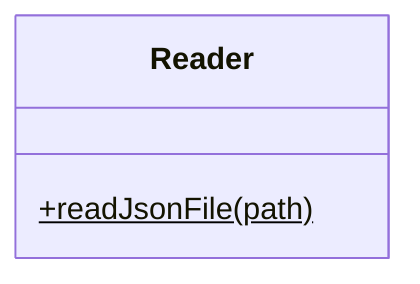
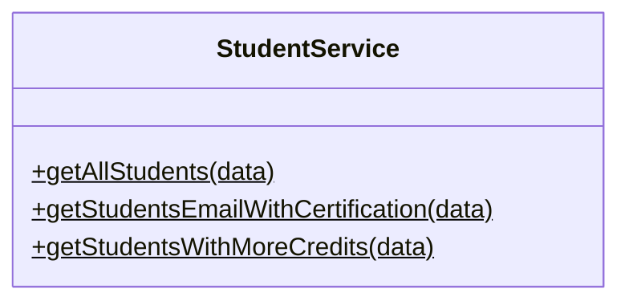
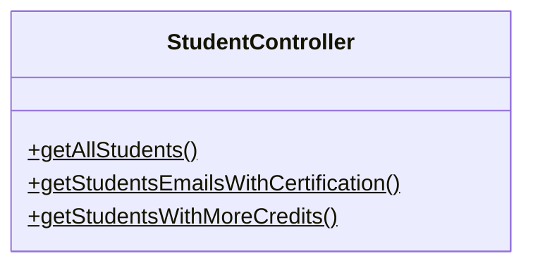
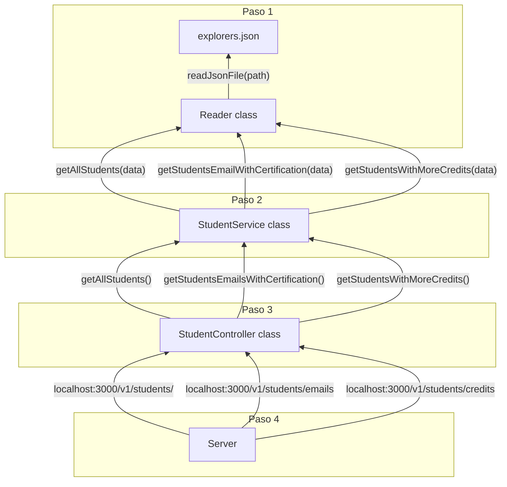

# Code Challenge

> Practica desarrollada por @carlogilmar en LaunchX - MissionNodeJS

## Dependencias

- Jest: 

Esta dependencia se utilizo para la creación de pruebas de unidad.

- ESLint:

Por medio de esta dependencia se le dio el formato (JavaScript) para los archivos del proyecto.

- Express:

Para crear el servidor con el cual se expuso la API desarrollada.

## Clases desarrolladas

## Flujo de la información

## Como se usa

Este proyecto se ejecuta por medio del comando `npm run server` el cual ejecuta el servidor para poder usar la API (usa el formato *JSON*).

La url que se usa es la siguinte:
- `localhost:3000/`

Los endpoints con los que cuenta la API son:

- `localhost:3000/v1/students/`

Que devuleve la una lista de estudiantes.

- `localhost:3000/v1/students/emails`

Que devuleve la una lista de emails de los estudiantes que han tenido una certificación.

- `localhost:3000/v1/students/credits`

Que devuleve la una lista de estudiantes que han tienen creditos mayor a 500 puntos.